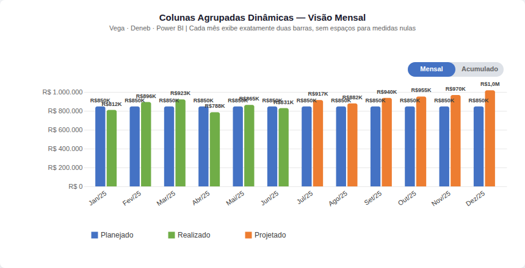
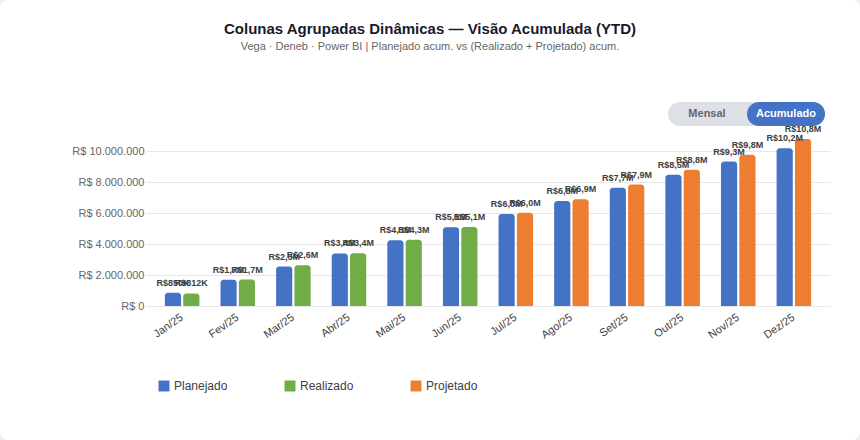

# Gráfico de Colunas Agrupadas Dinâmicas — Deneb / Power BI

Visual Vega para o Deneb (Power BI) que resolve o problema de espaços reservados para medidas nulas no gráfico nativo de colunas agrupadas.

## Screenshots

### Visão Mensal


### Visão Acumulada (YTD)


## O Problema

O gráfico nativo de colunas agrupadas do Power BI reserva espaço para **todas** as medidas existentes, mesmo quando são `BLANK()`. Para um cenário Planejado / Realizado / Projetado onde os meses futuros não têm Realizado e os meses passados não têm Projetado, o resultado é:

```
Janeiro: | Planejado | Realizado | (espaço vazio Projetado) |
Julho:   | Planejado | (espaço vazio Realizado) | Projetado |
```

## A Solução

Transformação dinâmica em formato longo: cada linha do dataset é convertida em exatamente **duas entradas** no dataset de barras — sem espaços reservados.

```
Janeiro → { serie: "Planejado", valor: 850000, ordem: 0 }
           { serie: "Realizado", valor: 812000, ordem: 1 }

Julho   → { serie: "Planejado", valor: 850000, ordem: 0 }
           { serie: "Projetado", valor: 917000, ordem: 1 }
```

A posição da segunda barra é calculada dinamicamente pela escala interna (`xinner`), garantindo largura e espaçamento constantes em todos os meses.

## Toggle Mensal / Acumulado

O visual inclui um botão segmentado interno (sem depender de slicers do Power BI) que alterna entre duas visões:

| Modo | Planejado | Realizado / Projetado |
|---|---|---|
| **Mensal** | Valor do mês | Valor do mês (Real ou Proj) |
| **Acumulado** | `cumsum(Planejado)` | `cumsum(Real + Proj)` YTD |

**Lógica do acumulado:**
- `_exec = Real OU Proj` por mês (nunca ambos ao mesmo tempo)  
- `_exec_acum = window cumsum(_exec)` → acumula a performance real/projetada ao longo do ano
- As cores se mantêm: verde para meses já realizados, laranja para meses projetados
- Os rótulos auto-escalam: `K` para valores < 1M, `M` para valores ≥ 1M

---

## Arquitetura do Spec Vega

```
dataset (Power BI)
   └── proc               ← Normaliza nomes de campo via signals
         ├── bars_plan    ← Planejado (sempre, ordem=0)
         ├── bars_real    ← Realizado (filtrado quando não nulo, ordem=1)
         └── bars_proj    ← Projetado (filtrado quando não nulo, ordem=1)
               └── bars   ← União final em formato longo

Escalas:
  xscale  (band) ← um slot por mês
  xinner  (band) ← dois slots por grupo [0, 1]
  yscale  (linear)
  color   (ordinal, 3 séries fixas na legenda)
```

---

## Como Usar no Deneb

### 1. Configurar os campos no Deneb

Adicione ao visual Deneb no Power BI:
- **Dimensão:** `Ano_Mes_abrev` (coluna de texto com o mês)
- **Medidas:** `m_Plan`, `m_Real`, `m_Proj`

> Os nomes dos campos são configuráveis via signals no topo do spec.

### 2. Colar o spec

Abra o editor do Deneb e cole o conteúdo de **`spec/deneb_spec.json`**.

> **Atenção:** o arquivo `spec/vega_test.json` contém dados de teste embutidos (para validação no [Vega Editor](https://vega.github.io/editor/)). O `deneb_spec.json` usa `"dataset"` como fonte e é o que deve ser colado no Deneb.

### 3. Ajustar os campos (se necessário)

Edite os `signals` no topo do spec para refletir os nomes exatos dos campos no seu modelo:

```json
"signals": [
  {"name": "campoMes",  "value": "Ano_Mes_abrev"},
  {"name": "campoPlan", "value": "m_Plan"},
  {"name": "campoReal", "value": "m_Real"},
  {"name": "campoProj", "value": "m_Proj"},
  ...
]
```

---

## Parâmetros Configuráveis

| Signal | Padrão | Descrição |
|---|---|---|
| `campoMes` | `"Ano_Mes_abrev"` | Nome do campo de mês no Deneb |
| `campoPlan` | `"m_Plan"` | Nome da medida Planejado |
| `campoReal` | `"m_Real"` | Nome da medida Realizado |
| `campoProj` | `"m_Proj"` | Nome da medida Projetado |
| `labelPlan` | `"Planejado"` | Texto na legenda/tooltip |
| `labelReal` | `"Realizado"` | Texto na legenda/tooltip |
| `labelProj` | `"Projetado"` | Texto na legenda/tooltip |
| `corPlan` | `"#4472C4"` | Cor da barra Planejado |
| `corReal` | `"#70AD47"` | Cor da barra Realizado |
| `corProj` | `"#ED7D31"` | Cor da barra Projetado |
| `paddingGrupo` | `0.3` | Espaço entre grupos de meses (0–1) |
| `paddingBarra` | `0.12` | Espaço entre as duas barras (0–1) |
| `raioAresta` | `3` | Arredondamento do topo das barras (px) |
| `mostrarRotulos` | `true` | Exibe rótulos de valor nas barras |
| `tamanhoRotulo` | `9` | Tamanho da fonte dos rótulos (px) |
| `modoAcumulado` | `false` | Toggle interno: `false` = mensal, `true` = acumulado YTD |

---

## Interatividade (apenas `deneb_spec.json`)

- **Cross-filtering:** clique em uma barra para filtrar outros visuais do relatório
- **`__selected__`:** barras não selecionadas ficam com opacidade 15%
- **Tooltip:** exibe Mês, Tipo e Valor ao passar o mouse
- **Drillthrough:** compatível com o drillthrough padrão do Power BI

---

## Estrutura do Repositório

```
spec/
  vega_test.json     ← Spec com dados embutidos (teste no Vega Editor)
  deneb_spec.json    ← Spec para colar no Deneb (usa "dataset" do Power BI)
preview/
  chart.html         ← Preview local (requer Vega via CDN ou npm install)
  screenshot.png     ← Print gerado automaticamente
render_screenshot.mjs ← Script Node.js para gerar screenshot offline
package.json
```

## Preview Local

Para abrir o preview no navegador com internet:

```
# Abra preview/chart.html no navegador
```

Para gerar o screenshot sem internet:

```bash
npm install
node render_screenshot.mjs
```

---

## Referências

- [Vega — Grouped Bar Chart](https://vega.github.io/vega/examples/grouped-bar-chart/)
- [Deneb Documentation](https://deneb-viz.github.io/)
- [Deneb Showcase (PBI-David)](https://github.com/PBI-David/Deneb-Showcase)
- [Vega Editor Online](https://vega.github.io/editor/)
